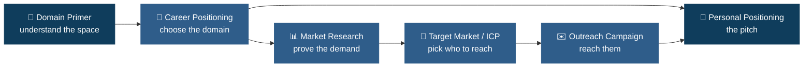

<!-- Optional banner: create assets/banner.png (see palette below) and uncomment -->
<!--  -->

# 🤖 GTM AI Engineering — Career & Market Positioning


> **LLMOps engineer who keeps GTM AI agents reliable, cost-controlled, and working in production, not just in the demo.**

---

## 📋 What this repo is

This repo is my research and positioning work for the **GTM AI** space: the software that helps companies find buyers, reach them, and close deals, now run by AI agents.

In plain terms, it answers four questions about my direction:
**Where am I headed** (the domain), **is there real demand** (the market), **who exactly do I help** (the customer profile), and **how do I reach them** (the outreach). It is written so a non-technical reader can follow every document, with the detail a technical reviewer needs underneath.

## 🎯 The one-line version

I help **GTM AI startups that ship AI agents** solve **agents that quietly break, drift, and run up cost after launch**, using **LLMOps: evaluation, monitoring, and reliability engineering.**

## 📂 What's inside

| Document | What it is (plain language) | Format | Best for |
|---|---|---|---|
| 🧭 [`domain_primer`](domain_primer.pdf) | A plain-English guide to how the GTM AI industry actually works: the players, the money, the workflows, and the problems. | PDF | Anyone new to the space |
| 🎯 [`career_positioning`](career_positioning.pdf) | Why I chose GTM AI, the 30 companies that define it, and three projects I can build. | PDF | The "where I'm headed and why" |
| 📊 [`market_research`](market_research.pdf) | Evidence the market has real demand: company counts, funding, live job postings, and five opportunities. Every claim is sourced. | PDF | Anyone checking the demand is real |
| 👥 [`target_market`](target_market.md) | Exactly which companies I target and who to talk to inside them (the ICP). | Markdown | Understanding my focus |
| ✉️ [`outreach_campaign`](outreach_campaign.md) | How I reach those companies: a two-track email sequence (technical and non-technical), with rules and safety checks. | Markdown | Seeing the go-to-market plan |
| 🪪 [`positioning`](positioning.md) | My short pitch: who I help, what I solve, and why I am credible. | Markdown | The 10-second summary |

> The `.md` files open directly on GitHub. The `.pdf` files open in GitHub's built-in viewer, or download to read offline.

## 🔗 How the pieces fit together

Each document feeds the next, from understanding the space down to the personal pitch.



## 🗂️ Repo structure

```
.
├── README.md              # you are here
├── domain_primer.pdf      # how the GTM AI industry works
├── career_positioning.pdf # domain choice, company landscape, projects
├── market_research.pdf    # market validation with sources
├── target_market.md       # ideal customer profile (ICP)
├── outreach_campaign.md   # two-track outreach sequence
└── positioning.md         # personal positioning statement
```

## 🧭 Suggested reading order

**If you're a recruiter or founder (short on time):**
1. [`positioning`](positioning.md) — the 10-second version
2. [`career_positioning`](career_positioning.pdf) — the direction and the projects
3. [`market_research`](market_research.pdf) — the evidence behind it

**If you're technical and want the depth:**
1. [`domain_primer`](domain_primer.pdf) — the space and its real problems
2. [`market_research`](market_research.pdf) — demand, skills, and five opportunities
3. [`target_market`](target_market.md) and [`outreach_campaign`](outreach_campaign.md) — the plan

## 👤 About

I'm an AI and ML engineer focused on the unglamorous side of AI agents: keeping them working once they're live. I help GTM AI teams catch the quiet failures, the drift, the cost creep, the demo that breaks on real data, before they show up in the numbers. Building the agent and making it last are the same job to me, and that second half is where most teams need the help.

**Core skills:** Python · Docker & Kubernetes · RAG · evaluations & observability · scoring models · LLMOps / MLOps

## 📬 Contact

- **Email:** afiaartedu@gmail.com
- **LinkedIn:** https://www.linkedin.com/in/asfiya-mukthasar-1b56a126a/

---

*Part of the AI Engineering Cohort, career and market positioning track.*
